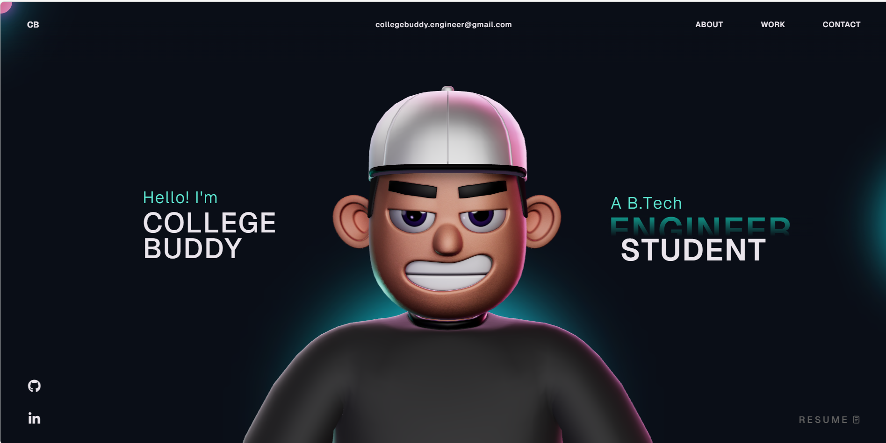

<div align="center">

```
██████╗  ██████╗ ██████╗ ████████╗███████╗ ██████╗ ██╗     ██╗ ██████╗
██╔══██╗██╔═══██╗██╔══██╗╚══██╔══╝██╔════╝██╔═══██╗██║     ██║██╔═══██╗
██████╔╝██║   ██║██████╔╝   ██║   █████╗  ██║   ██║██║     ██║██║   ██║
██╔═══╝ ██║   ██║██╔══██╗   ██║   ██╔══╝  ██║   ██║██║     ██║██║   ██║
██║     ╚██████╔╝██║  ██║   ██║   ██║     ╚██████╔╝███████╗██║╚██████╔╝
╚═╝      ╚═════╝ ╚═╝  ╚═╝   ╚═╝   ╚═╝      ╚═════╝ ╚══════╝╚═╝ ╚═════╝
```

# ✦ Animated Developer Portfolio ✦

**A slick, open-source animated portfolio — built with React, GSAP & Three.js**

[](https://reactjs.org/)
[](https://www.typescriptlang.org/)
[](https://gsap.com/)
[](https://threejs.org/)
[](LICENSE)

</div>

---

## ⚡ Preview Imgae



---

## 🛠️ Tech Stack

| Technology             | Purpose                              |
| ---------------------- | ------------------------------------ |
| **React + TypeScript** | Component architecture & type safety |
| **GSAP**               | Smooth scroll & timeline animations  |
| **Three.js + WebGL**   | 3D visuals & interactive background  |
| **HTML / CSS / JS**    | Structure, styling & interactivity   |

---

## 🚀 Getting Started

### 1. Download (Important ⚠️)

> **Do NOT clone this repo.** Some files have large sizes that get missed during clone.
>
> ✅ **Always download as ZIP** from the green `Code` button → `Download ZIP`

### 2. Install Dependencies

```bash
npm install
```

### 3. Run Locally

```bash
npm run dev
```

Open `http://localhost:5173` in your browser — you're live! 🎉

---

## ⚠️ GSAP Club Plugins Notice

This project uses **GSAP Club Plugins** — these are premium plugins.

For the open-source version, the trial plugins are included, but:

```
🔴 Trial plugins = Cannot be used for hosted/production deployments
✅ Club plugins  = Required for hosting your site publicly
```

👉 Get Club plugins here: [gsap.com/docs/v3/Installation](https://gsap.com/docs/v3/Installation/)

---

## ✏️ Customization

Want to make this your own? Follow these steps:

1. **Edit your details** — Update name, bio, skills & socials in the data/config files
2. **Connect your GitHub** — Link your GitHub to auto-display your projects
3. **Add your character** — Drop in your custom 3D or 2D character to personalize the vibe
4. **Swap colors/fonts** — Tweak the CSS variables to match your aesthetic

> 💡 Tip: Use an AI IDE like **Antigravity** or **Cursor** and paste your resume data with a simple prompt — your portfolio updates in minutes.

---

## 📁 Project Structure

```


---

## 📜 License

This project is open source and available under the [MIT License](LICENSE).

---

<div align="center">

**Made with 🖤 — Fork it. Customize it. Make it yours.**

⭐ Star this repo if you found it helpful!

</div>
```
